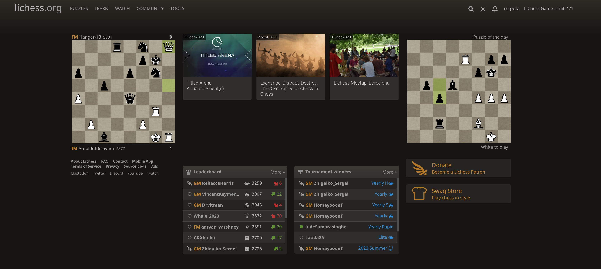

# LiChess Game Limit - Chrome Extension

## Table of Contents

- [LiChess Game Limit - Chrome Extension](#lichess-game-limit---chrome-extension)
  - [Table of Contents](#table-of-contents)
  - [Description](#description)
  - [Installlation](#installlation)
  - [Features](#features)
    - [Game Limit](#game-limit)
    - [Tilt preventer](#tilt-preventer)
  - [Known Issues](#known-issues)
  - [Credits](#credits)

## Description

This chrome extension can be used to place a limit on your Lichess games! This extension hides all UI elements used to create a new game on lichess.org once you have reached your limit. The website can be used for all other features including analyzing your old games and puzzles.

## Installlation

- Clone this repository.
- `cd frontend; npm install; npm run build;`
- Go to the Extensions page by entering `chrome://extensions` in a new tab.
- Enable Developer Mode by clicking the toggle switch next to Developer mode.
- Click the Load unpacked button and select the extension directory.

## Features

### Game Limit

- Click the extension icon on Chrome.
- Enter your Lichess username and the game limit per day on that account.
- The limit resets at midnight every day.

### Tilt preventer

- Lock Lichess if you lose 50 rating points in a day.
- Coming soon!

## Known Issues

- Be able to limit by game type such as Blitz/Bullet/Rapid.
- Count resets at midnight everyday. Implement a feature that determines reset time.
- Need to expand into Chess.com
- Implement tilt preventer feature.

## Credits

<a href="https://www.flaticon.com/free-icons/checkmate" title="checkmate icons">Extension icon created by BZZRINCANTATION - Flaticon</a>
